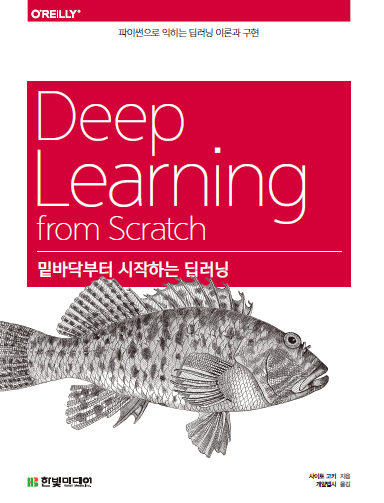

## 밑바닥부터 시작하는 딥러닝정리

- [Chapter2.Perceptron](https://www.notion.so/Chapter2-Perceptron-47e2bde2a18245778cbcd0f1fa44037c)
  - 2.1 퍼셉트론이란?
  - 2.2 단순한 논리 회로
  - 2.3 퍼셉트론 구현하기
  - 2.4 퍼셉트론의 한계
  - 2.5 다층 퍼셉트론이 충돌한다면
  - 2.6 NAND에서 컴퓨터까지
  - 2.7 정리
- [Chapter3.Neural Network](https://www.notion.so/Chapter3-Neural-Network-670e67b693cf48b697d46cc19e7b13ed)
  - 3.1 퍼셉트론에서 신경망으로
  - 3.2 활성화함수
  - 3.3 다차원 배열의 계산
  - 3.4 3층 신경망 구현하기
  - 3.5 출력층 설계하기
  - 3.6 손글씨 숫자 인식
  - 3.7 정리
- [Chapter4. Neural Network training](https://www.notion.so/Chapter4-Neural-Network-training-9b68c94350f746b096e83a7cf79cca6e)
  - 4.1 데이터에서 학습한다!
  - 4.2 손실함수
  - 4.3 수치미분
  - 4.4 기울기
  - 4.5 학습 알고리즘 구현하기
  - 4.6 정리
- [Chapter5. Backpropagation](https://www.notion.so/Chapter5-Backpropagation-dcc562f87b0a455da43d0a45c87f1ccc)
  - 5.1 계산그래프
  - 5.2 연쇄법칙
  - 5.3 역전파
  - 5.4 단순하 계층 구현하기
  - 5.5 활성화 함수 구현하기
  - 5.6 Affine/Softmax 계층 구현하기
  - 5.7 오차역전파법 구현하기
  - 5.8 정리
- [Chapter7. convolutional neural network, CNN](https://www.notion.so/Chapter7-convolutional-neural-network-CNN-ea9194d6ce5d4619a3856fff68446739)
  - 7.1 전체구조
  - 7.2 합성곱 계층
  - 7.3 풀링계층
  - 7.4 합성곱/풀리 계층 구현하기
  - 7.5 CNN 구현하기
  - 7.6 CNN 시각화하기
  - 7.7 대표적인 CNN
  - 7.8 정리
