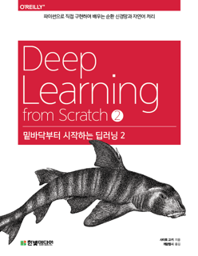

## 밑바닥부터 시작하 딥러닝 2

- [Chapter2. 자연어와 단어의 분산 표현](https://foul-beechnut-069.notion.site/Chapter2-2d43eafacb2a46738588c5f86482684f)
  - 2.1 자연어 처리란
  - 2.2 시소러스
  - 2.3 통계 기반 기법
  - 2.4 통계 기반 기법 개선하기
  - 2.5 정리
- [Chapter3. word2vec](https://foul-beechnut-069.notion.site/Chapter3-word2vec-b017e0a388d6400180351dc3d018bc7b)
  - 3.1 추론 기반 기법과 신경망
  - 3.2 단순한 word2vec
  - 3.3 학습 데이터 준비
  - 3.4 CBOW 모델 구현
  - 3.5 word2vec 보충
  - 3.6 정리
- [Chapter4. word2vec 속도 개선](https://foul-beechnut-069.notion.site/Chapter4-word2vec-4a5e598978384edf8c9312f64d9fac63)
  - 4.1 word2vec 개선 1️⃣
  - 4.2 word2vec 개선 2️⃣
  - 4.3 개선판 word2vec학습
  - 4.4 word2vec 남은 주제
  - 4.5 정리
- [Chapter5. 순환 신경망(RNN)](https://foul-beechnut-069.notion.site/Chapter5-RNN-bb66d19e129a43caba1027ae7a19ae30)
  - 5.1 확률과 언어 모델
  - 5.2 RNN이란
  - 5.3 RNN 구현
  - 5.4 시계열 데이터 처리 계층 구현
  - 5.5 RNNLM 학습과 평가
  - 5.6 정리
- [Chapter6. 게이트가 추가된 RNN](https://foul-beechnut-069.notion.site/Chapter6-RNN-9a5434e0807a49268e2d1fd5fe416744)
  - 6.1 RNN의 문제점
  - 6.2 기울기 소실과 LSTM
  - 6.3 LSTM 구현
  - 6.4 LSTM을 사용한 언어 모델
  - 6.5 RNNLM 추가 개선
  - 6.6 정리
- [Chapter7. RNN을 사용한 문장 생성](https://foul-beechnut-069.notion.site/Chapter7-RNN-034b2306113b41ccbcc9fad489032786)
  - 7.1 언어 모델을 사용한 문장 생성
  - 7.2 seq2seq
  - 7.3 seq2seq 구현
  - 7.4 seq2seq 개선
  - 7.5 seq2seq를 이용하는 애플리케이션
  - 7.6 정리
- [Chapter8. Attention](https://foul-beechnut-069.notion.site/Chapter8-Attention-3bcaf35070da4a8bbd89b70504929160)
  - 8.1 어텐션의 구조
  - 8.2 어텐션 평가 
  - 8.3 어텐션에 관한 남은 이야기
  - 8.4 어텐션 응용
  - 8.5 정리
  
## 참고문헌
: https://github.com/WegraLee/deep-learning-from-scratch-2
